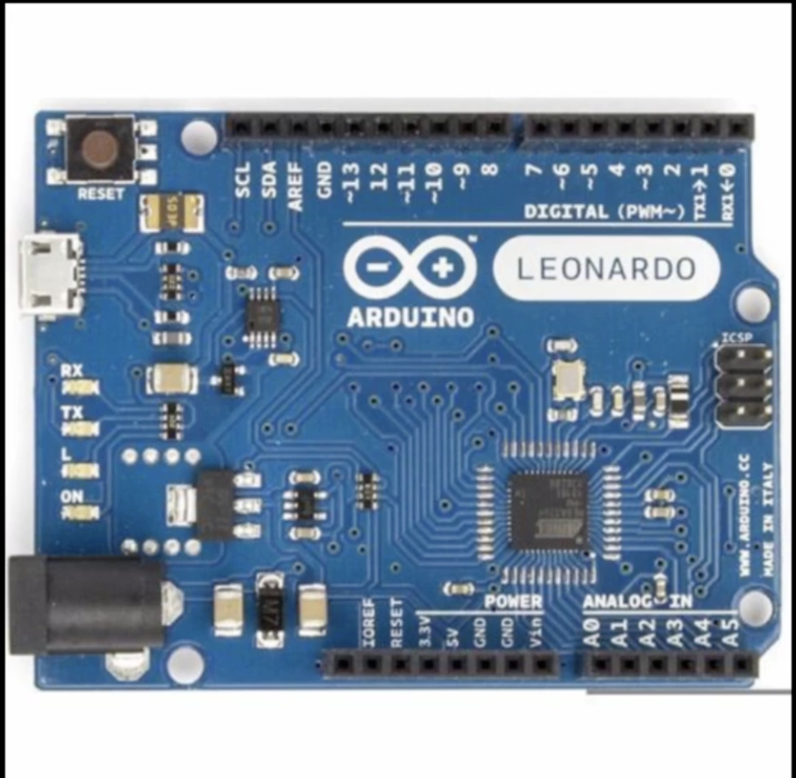
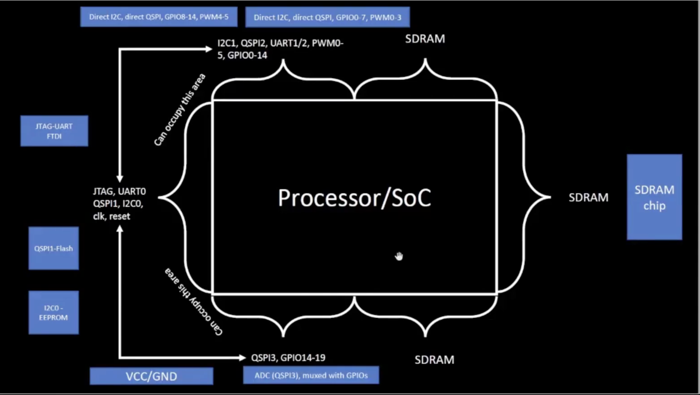
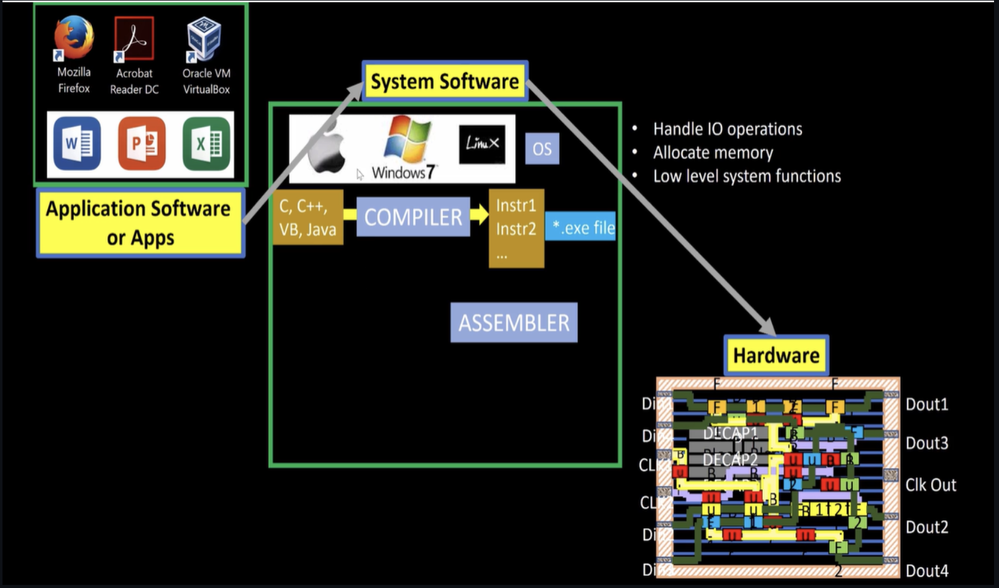
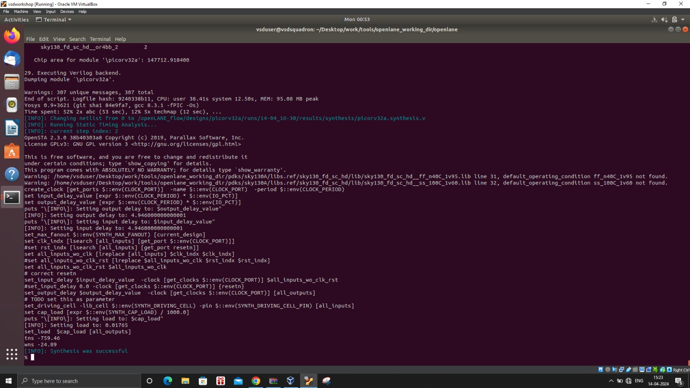

# Nasscom_VLSI_SoC_Design_Course

## DAY 1 - Inception of open-source EDA, OpenLANE and sky130 PDK

### 1.	How to talk to computers?

#### 1.1.1 Introduction: 

This is the typical Arduino Leonardo Board. The highlighted part is the chip, and we are going to learn more about the design and contents of the chip in this course. This chip is designed from synthesis all the way down for production using the RTL to GDSll pipeline. Arduino consists of a programmable circuit board and a piece of software, or IDE that runs on a computer and is used to create and upload computer code to Arduino. 



The below image describes the schematic representation of a microprocessor/ S-o-C architecture, it contains processor/SoC, SDRAM, Vcc/GND, ADC, QSPL1- Flash, UART ports, SPI ports. 



**Processor/SoC:** This system-on-a-chip that is the main component which runs the whole system. 
I2C1, QSPI2, UART1/2, PWM0-5, GPIO00-14: These are peripheral interfaces and though these input/output (I/O) signals are directly connected to the processor/SoC. (Which will be discussed in the later part again). 

**SDRAM:** This represents the synchronous dynamic random-access memory (SDRAM) connected to the processor/SoC.
**I2C0-EEPROM:** This is an I2C (Inter-Integrated Circuit) EEPROM (Electrically Erasable Programmable Read-Only Memory) component connected to the processor/SoC.

**QSPI1-Flash:** This is a QSPI (Quad Serial Peripheral Interface) flash memory component connected to the processor/SoC.

**JTAG-UART-FTDI:** The block represents the JTAG (Joint Test Action Group) interface, UART (Universal Asynchronous Receiver-Transmitter), and FTDI (Future Technology Devices International) components, which are used for debugging, programming, and communication purposes.

#### 1.1.2	Introduction to Risc V 

RISC-V is an open-source instruction set architecture (ISA) based on reduced instruction set computing (RISC) concepts. It has a modular design with several common extensions, enabling for customization based on unique application demands. RISC-V architectures value simplicity, efficiency, and scalability, making them suited for a wide range of applications, from microcontrollers to high-performance computing systems. RISC-V, with its expanding ecosystem and widespread industrial adoption, has the potential to define the future of computer architecture.  The RISC-V instruction set architecture (ISA) is intended to be adaptable, with a core set of 32-bit naturally aligned instructions supplemented with variable-length extensions for increased flexibility. It supports a variety of address space variants, including 32-bit, 64-bit, and a proposed 128-bit flat address space, but has yet to be finalized due to a lack of practical experience.
The below image shows how is the chip connected on the inside. 

 


#### 1.1.3	From Software Applications to Hardware
This picture presents a conceptual overview of a computer system's basic architecture, emphasizing the roles of both software and hardware in enabling the device's complete functioning and capabilities.


 


The transition from software to hardware has 3 layers. The application layer, this layer includes user-facing software like as productivity apps and other programs with which users interact directly. These apps rely on the underlying system software to deliver functionality and communicate with the hardware.
The software, it consists of the operating system (e.g., Windows 7, Linux) and the compiler, which converts high-level programming languages (C, C++, VB, and Java) into machine-readable instructions.  The assembler is responsible for converting these instructions into the final executable (.exe) file that can be run on the hardware.  The physical computing equipment consists of components such as the processor (CPU), memory, input/output (I/O) devices, and other peripherals. The hardware executes the software's machine-level instructions, doing computations and data processing.

### 1.2	ASIC Design Flow

 

This picture displays the electronic design automation (EDA) pipeline for producing an integrated circuit (IC) or chip. The procedure begins with the creation of a Register Transfer Level (RTL) description, which is subsequently converted into a gate-level network list. Static Timing Analysis (STA) and Design for Testability (DFT) approaches are used to ensure timing restrictions and testability. The following processes include floor planning, placement, clock tree synthesis, optimization, thorough routing, and different verification tests to ensure that the physical layout matches the logical design. Scripts are used to introduce phony vias and diodes in order to increase production yield. Finally, the design is converted to the GDSII format, which is the standard for semiconductor manufacturing, to complete the comprehensive EDA procedure.

#### 1.2.1	Simplified RTL2GDS flow

The first phase in the flow is synthesis, which converts the RTL code to a netlist. A netlist is a list of a circuit's components and their connections. The next phase is clock tree synthesis (CTS), which is the process of creating a circuit to distribute the clock signal throughout the chip. After the netlist and CTS are finished, the layout and power planning are completed. The floorplan is the circuit layout, and power planning is the process of constructing the circuit such that it has enough power.


 
 

#### 1.2.3 Introduction to OpenLane 

OpenLane is an open-source, fully automated RTL to GDSII pipeline that employs a variety of popular open-source EDA tools at various phases of the IC design cycle. OpenLane is based on a suite of EDA tools that operate together to enable the entire chip design pipeline, from RTL to final GDSII layout. It consists of : 

| Software | Description |
|-----:|---------------|
|  Yosys	  | Verilog synthesis tool           |
|  Magic   | Layout editor                    |
|  Netgen  | Digital netlist comparison tool  |
|  Fault   | Digital fault simulator          |
|  CVC SPEF-Extractor | Extractor	Circuit verification and analysis tool  |
| CU-GR    | Global routing tool              |
| Klayout  | Mask layout editor and viewer    | 


Files inside open lane directory: 

```
Directory Structure
openlane/
├── AUTHORS.md
├── clean_runs.tcl
├── configuration
├── conf.py
├── CONTRIBUTING.md
├── default.cvcrc
├── designs
├── docker_build
├── docs
├── flow.tcl
├── LICENSE
├── Makefile
├── README.md
├── regression_results
├── report_generation_wrapper.py
├── run_designs.py
└── scripts
```

We have used picorv32a for demonstration of this experiment. The contents of picorv32a are: 
```
picorv32a

├── config.tcl
├── runs
├── sky130A_sky130_fd_sc_hd_config.tcl
├── sky130A_sky130_fd_sc_hdll_config.tcl
├── sky130A_sky130_fd_sc_hs_config.tcl
├── sky130A_sky130_fd_sc_ls_config.tcl
├── sky130A_sky130_fd_sc_ms_config.tcl
└── src
    ├── picorv32a.sdc
    └── picorv32a.v
```

### 1.3 Working of Openlane 


We have to start openlane with the following command: 

``` docker ./flow.tcl – interactive ```  

The interactive term is used to run every stage of the process by us, if we don’t run with interactive then the RTS to GDS II flow will be completed directly. 

Once we run the command, Openlane runs, after we need to run next command in openlane, and it is package require openlane 0.9 and then we have to execute ``` prep -design picorv32a ``` . This will help in preparation of the design. 

It will look like in the below picture once it is successfully executed. 

  

Once the preparation is completed, we will run a command run synthesis

  


The run synthesis command will do the synthesis process and produces the results. Once it is completed, we will be able to see synthesis was successful and it will look like below, 

  


After the synthesis is successful, to see the results of synthesis process we can go into following directories, 

```Cd ~/Desktop/work/tools/openlane_working_dir/openlane/designs/picorv32a/runs/14-04_16-30/reports/synthesis```

This command would take us to the directory where all the results are stored and it looks as below. 

  

We can use ```less``` command to see what is in the output reports. 

The timing report would look like this; 

  

The detailed analysis can be performed using the printing statistics that we get from the report. 

 

We can see that dxftp value is 1613 and the total number of wires are 14876 so, the flop ratio is 

``` (value of dxftp/total number of cells) * 100 = (1613/14876) ``` which is approximately 10.84%. 

After the synthesis process, we can also observe the ABC mappings, 

  


  ## DAY 2 - Good Floorplan vs Bad Floorplan and Introduction to library cells
  ### 2.1 Chip FloorPlan Considerations
  #### 2.1.1 Utilization factor and Aspect Ratio

This section is basically for the height & width of the core and die. Te basic Idea is to start with a Netlist. A netlist decribes the connectivity of the electronic design. To define the dimensions of the chip, the dimensions of the netlist are required i.e; the logic gates and flip flops used in the chip. 

Considering the standard cell dimensions 1 unit and 1 unit and asuuming the same area for the flipflop too 
This means area = 1unit * 1unit = 1 Sq. units. 


Combining all the flipflops together the length and width would be 2 units and 2 units. Therefore the toatl area would be 4 sq units. 


Core is the fundamental part where the logic is put and the die is the outer layer of the core. Die is a semiconductor material specimen on which the fundamental circuit is fabricated. If the logic completely occupies the core area then the utilization factor would be 100% i.e; 1. 

Utilization Factor can be well described as, 

UF = Area occupied by Netlist/Total area of the core 

Aspect Ratio = Height/Width. 

If the aspect ratio is 1, it means that the chip is square and when AR is any other value then it means the chip is rectangle. 

#### 2.1.2 Concept of Preplaced Cells 

Let's consider an example of a big combinational logic with N logic gates. Breaking down this combinational logic into granular parts i.e; breaking the circuit into 2 blocks and executing them seperately. The I/O pins of them are extended and connected. 

Each box is backboxed i.e; copied and made invisible to the top netlist. The major advantage of this process is that the black box can be used multiple times on the netlist. The 2 boxes can be given to two seperate users and they can be connected accordingly. 

The main concept of the preplaced cells is that the cells are executed only once and they can be reused in the netlist whenever there is a similar kind of requirement.  

This arrangement of the IP's in the chip is called as Floorplanning. SInce they are placed before the placement and Routing, they are called Preplaced-cells. 

#### 2.1.3 Decoupling Capacitors. 

Considering a design background, to define the location of the cells, left side has all input pins and right side has all output pins. From the design summary we can get to know about the I/O pins, the blocks which are communicating with the Input Pins. 

All the blocks A,B,C are placed close to the input side, these cells are placed depending on the design scenario, the location isn't touched. Once they are placed the locations cannot be changed. They should be well designed and they should be observed. 

considering a circuit. In this case the circuit gets the power supply from the main supply itself, since the main supply is far from the circuit, there would be a voltage drop and losses. So, if we consider 1 volt is taken from Vdd, by the time it reaches the circuit, Vdd' will be 0.7 or 0.8 and the rest of it is drained in the voltage loss. 


If the voltage is in undefined region then it might go towards logic 1 or logic 0. 

Therefore to reduce this, Decoupled capacitors are placed. In this case, the decoupled capacitors act like a charge buffer, they are placed close to the circuit and they provide continous supply to the circuit. When the logic has to be 1 the capacitior discharges and provides the required voltage. When it has to charge, it takes the voltage from main power supply. 

This eliminates the voltage drops and continously provides voltage to the circuit making sure it is not in undefined region. 


