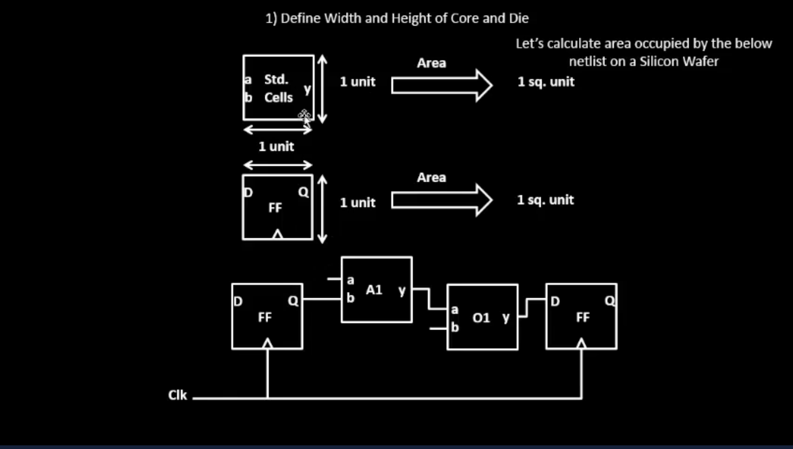
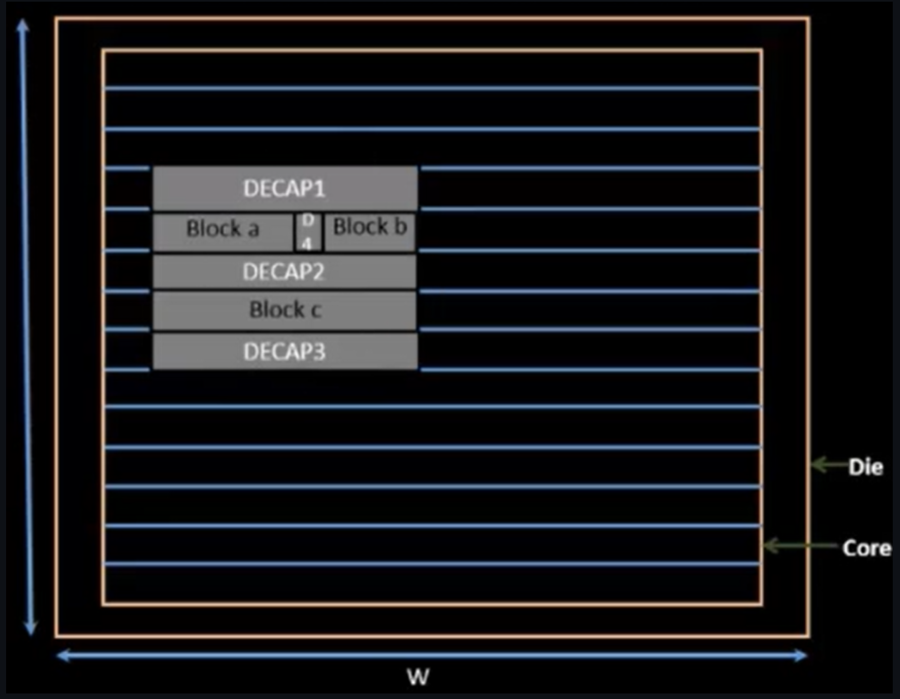
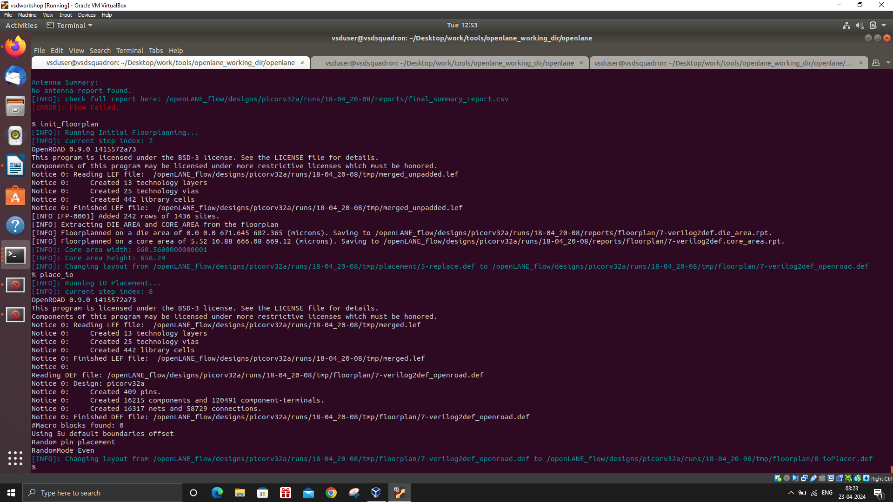
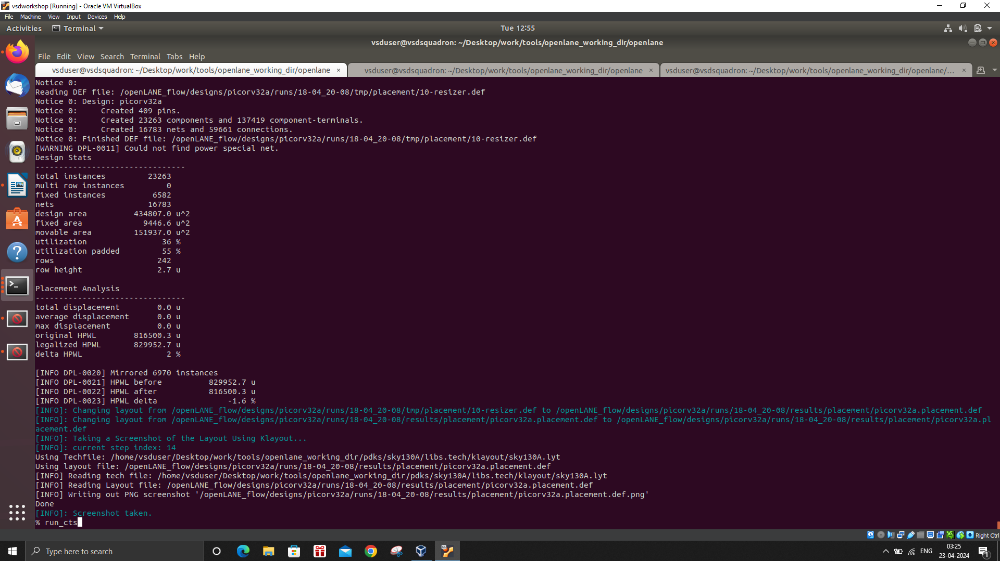
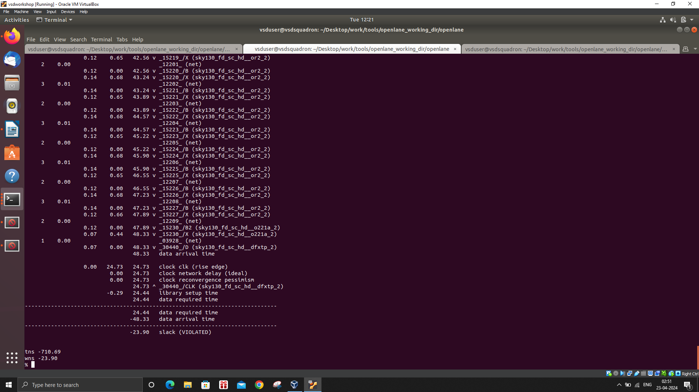

# Nasscom_VLSI_SoC_Design_Course

## DAY 1 - Inception of open-source EDA, OpenLANE and sky130 PDK

### 1.	How to talk to computers?

#### 1.1.1 Introduction: 

This is the typical Arduino Leonardo Board. The highlighted part is the chip, and we are going to learn more about the design and contents of the chip in this course. This chip is designed from synthesis all the way down for production using the RTL to GDSll pipeline. Arduino consists of a programmable circuit board and a piece of software, or IDE that runs on a computer and is used to create and upload computer code to Arduino. 


The below image describes the schematic representation of a microprocessor/ S-o-C architecture, it contains processor/SoC, SDRAM, Vcc/GND, ADC, QSPL1- Flash, UART ports, SPI ports. 


**Processor/SoC:** This system-on-a-chip that is the main component which runs the whole system. 
I2C1, QSPI2, UART1/2, PWM0-5, GPIO00-14: These are peripheral interfaces and though these input/output (I/O) signals are directly connected to the processor/SoC. (Which will be discussed in the later part again). 

**SDRAM:** This represents the synchronous dynamic random-access memory (SDRAM) connected to the processor/SoC.
**I2C0-EEPROM:** This is an I2C (Inter-Integrated Circuit) EEPROM (Electrically Erasable Programmable Read-Only Memory) component connected to the processor/SoC.

**QSPI1-Flash:** This is a QSPI (Quad Serial Peripheral Interface) flash memory component connected to the processor/SoC.

**JTAG-UART-FTDI:** The block represents the JTAG (Joint Test Action Group) interface, UART (Universal Asynchronous Receiver-Transmitter), and FTDI (Future Technology Devices International) components, which are used for debugging, programming, and communication purposes.

#### 1.1.2	Introduction to Risc V 

RISC-V is an open-source instruction set architecture (ISA) based on reduced instruction set computing (RISC) concepts. It has a modular design with several common extensions, enabling for customization based on unique application demands. RISC-V architectures value simplicity, efficiency, and scalability, making them suited for a wide range of applications, from microcontrollers to high-performance computing systems. RISC-V, with its expanding ecosystem and widespread industrial adoption, has the potential to define the future of computer architecture.  The RISC-V instruction set architecture (ISA) is intended to be adaptable, with a core set of 32-bit naturally aligned instructions supplemented with variable-length extensions for increased flexibility. It supports a variety of address space variants, including 32-bit, 64-bit, and a proposed 128-bit flat address space, but has yet to be finalized due to a lack of practical experience.
The below image shows how is the chip connected on the inside. 

 


#### 1.1.3	From Software Applications to Hardware
This picture presents a conceptual overview of a computer system's basic architecture, emphasizing the roles of both software and hardware in enabling the device's complete functioning and capabilities.


 


The transition from software to hardware has 3 layers. The application layer, this layer includes user-facing software like as productivity apps and other programs with which users interact directly. These apps rely on the underlying system software to deliver functionality and communicate with the hardware.
The software, it consists of the operating system (e.g., Windows 7, Linux) and the compiler, which converts high-level programming languages (C, C++, VB, and Java) into machine-readable instructions.  The assembler is responsible for converting these instructions into the final executable (.exe) file that can be run on the hardware.  The physical computing equipment consists of components such as the processor (CPU), memory, input/output (I/O) devices, and other peripherals. The hardware executes the software's machine-level instructions, doing computations and data processing.

### 1.2	ASIC Design Flow

 

This picture displays the electronic design automation (EDA) pipeline for producing an integrated circuit (IC) or chip. The procedure begins with the creation of a Register Transfer Level (RTL) description, which is subsequently converted into a gate-level network list. Static Timing Analysis (STA) and Design for Testability (DFT) approaches are used to ensure timing restrictions and testability. The following processes include floor planning, placement, clock tree synthesis, optimization, thorough routing, and different verification tests to ensure that the physical layout matches the logical design. Scripts are used to introduce phony vias and diodes in order to increase production yield. Finally, the design is converted to the GDSII format, which is the standard for semiconductor manufacturing, to complete the comprehensive EDA procedure.

#### 1.2.1	Simplified RTL2GDS flow

The first phase in the flow is synthesis, which converts the RTL code to a netlist. A netlist is a list of a circuit's components and their connections. The next phase is clock tree synthesis (CTS), which is the process of creating a circuit to distribute the clock signal throughout the chip. After the netlist and CTS are finished, the layout and power planning are completed. The floorplan is the circuit layout, and power planning is the process of constructing the circuit such that it has enough power.


 
 

#### 1.2.3 Introduction to OpenLane 

OpenLane is an open-source, fully automated RTL to GDSII pipeline that employs a variety of popular open-source EDA tools at various phases of the IC design cycle. OpenLane is based on a suite of EDA tools that operate together to enable the entire chip design pipeline, from RTL to final GDSII layout. It consists of : 

| Software | Description |
|-----:|---------------|
|  Yosys	  | Verilog synthesis tool           |
|  Magic   | Layout editor                    |
|  Netgen  | Digital netlist comparison tool  |
|  Fault   | Digital fault simulator          |
|  CVC SPEF-Extractor | Extractor	Circuit verification and analysis tool  |
| CU-GR    | Global routing tool              |
| Klayout  | Mask layout editor and viewer    | 


Files inside open lane directory: 

```
Directory Structure
openlane/
├── AUTHORS.md
├── clean_runs.tcl
├── configuration
├── conf.py
├── CONTRIBUTING.md
├── default.cvcrc
├── designs
├── docker_build
├── docs
├── flow.tcl
├── LICENSE
├── Makefile
├── README.md
├── regression_results
├── report_generation_wrapper.py
├── run_designs.py
└── scripts
```

We have used picorv32a for demonstration of this experiment. The contents of picorv32a are: 
```
picorv32a

├── config.tcl
├── runs
├── sky130A_sky130_fd_sc_hd_config.tcl
├── sky130A_sky130_fd_sc_hdll_config.tcl
├── sky130A_sky130_fd_sc_hs_config.tcl
├── sky130A_sky130_fd_sc_ls_config.tcl
├── sky130A_sky130_fd_sc_ms_config.tcl
└── src
    ├── picorv32a.sdc
    └── picorv32a.v
```

### 1.3 Working of Openlane 


We have to start openlane with the following command: 

``` docker ./flow.tcl – interactive ```  

The interactive term is used to run every stage of the process by us, if we don’t run with interactive then the RTS to GDS II flow will be completed directly. 

Once we run the command, Openlane runs, after we need to run next command in openlane, and it is package require openlane 0.9 and then we have to execute ``` prep -design picorv32a ``` . This will help in preparation of the design. 

It will look like in the below picture once it is successfully executed. 

  

Once the preparation is completed, we will run a command run synthesis

  


The run synthesis command will do the synthesis process and produces the results. Once it is completed, we will be able to see synthesis was successful and it will look like below, 

  


After the synthesis is successful, to see the results of synthesis process we can go into following directories, 

```Cd ~/Desktop/work/tools/openlane_working_dir/openlane/designs/picorv32a/runs/14-04_16-30/reports/synthesis```

This command would take us to the directory where all the results are stored and it looks as below. 

  

We can use ```less``` command to see what is in the output reports. 

The timing report would look like this; 

  

The detailed analysis can be performed using the printing statistics that we get from the report. 

 

We can see that dxftp value is 1613 and the total number of wires are 14876 so, the flop ratio is 

``` (value of dxftp/total number of cells) * 100 = (1613/14876) ``` which is approximately 10.84%. 

After the synthesis process, we can also observe the ABC mappings, 

  


  ## DAY 2 - Good Floorplan vs Bad Floorplan and Introduction to library cells
  ### 2.1 Chip FloorPlan Considerations
  #### 2.1.1 Utilization factor and Aspect Ratio

This section is basically for the height & width of the core and die. Te basic Idea is to start with a Netlist. A netlist decribes the connectivity of the electronic design. To define the dimensions of the chip, the dimensions of the netlist are required i.e; the logic gates and flip flops used in the chip. 

Considering the standard cell dimensions 1 unit and 1 unit and asuuming the same area for the flipflop too 
This means area = 1unit * 1unit = 1 Sq. units. 



Combining all the flipflops together the length and width would be 2 units and 2 units. Therefore the toatl area would be 4 sq units. 


Core is the fundamental part where the logic is put and the die is the outer layer of the core. Die is a semiconductor material specimen on which the fundamental circuit is fabricated. If the logic completely occupies the core area then the utilization factor would be 100% i.e; 1. 

Utilization Factor can be well described as, 

UF = Area occupied by Netlist/Total area of the core 

Aspect Ratio = Height/Width. 

If the aspect ratio is 1, it means that the chip is square and when AR is any other value then it means the chip is rectangle. 

#### 2.1.2 Concept of Preplaced Cells 

Let's consider an example of a big combinational logic with N logic gates. Breaking down this combinational logic into granular parts i.e; breaking the circuit into 2 blocks and executing them seperately. The I/O pins of them are extended and connected. 


Each box is backboxed i.e; copied and made invisible to the top netlist. The major advantage of this process is that the black box can be used multiple times on the netlist. The 2 boxes can be given to two seperate users and they can be connected accordingly. 


The main concept of the preplaced cells is that the cells are executed only once and they can be reused in the netlist whenever there is a similar kind of requirement.  

This arrangement of the IP's in the chip is called as Floorplanning. SInce they are placed before the placement and Routing, they are called Preplaced-cells. 

#### 2.1.3 Decoupling Capacitors. 

Considering a design background, to define the location of the cells, left side has all input pins and right side has all output pins. From the design summary we can get to know about the I/O pins, the blocks which are communicating with the Input Pins. 

All the blocks A,B,C are placed close to the input side, these cells are placed depending on the design scenario, the location isn't touched. Once they are placed the locations cannot be changed. They should be well designed and they should be observed. 

Considering a circuit. In this case the circuit gets the power supply from the main supply itself, since the main supply is far from the circuit, there would be a voltage drop and losses. So, if we consider 1 volt is taken from Vdd, by the time it reaches the circuit, Vdd' will be 0.7 or 0.8 and the rest of it is drained in the voltage loss. 


If the voltage is in undefined region then it might go towards logic 1 or logic 0. 


Therefore to reduce this, Decoupled capacitors are placed. In this case, the decoupled capacitors act like a charge buffer, they are placed close to the circuit and they provide continous supply to the circuit. When the logic has to be 1 the capacitior discharges and provides the required voltage. When it has to charge, it takes the voltage from main power supply. 


This eliminates the voltage drops and continously provides voltage to the circuit making sure it is not in undefined region. The chip looks like this after placing the decoupling capacitors. 



#### 2.1.4 Power Planning

Considering a complete circuit with 4 Macros and logic. Connecting all the Macros to the power supply, the ground lines are tapped to the ground. Assume the 'red' path is 16 bit bus, and the supply power is source. 
When logic is 1 it is charged to voltage V 


the inverter changes from logic 0 to logic 1 or vice versa, that means all the capacitord which are charged will be discharged and all the discharged ones will be charged. Since all the charged capacitors are discharged to ground, there is a bounce, and it is called as Ground bounce. If the bounce moves to the undefined region, it might be a problem.


When all the capacitors charge, then there is demand in power supply and then voltage droop occurs. As long as the droop is in Noise Margin, there shouldn't be a problem. This is called mainly because of one power supply for the whole region. Instead of single power supply, we would have multiple to facilitate the power for all the macros. 


#### 2.1.5 Pin Placement and Logical cell placement blockage. 
Circuit 1 is powered by clk1, circuit 2 by clk2, and they have separate inputs (Din1 and Din2) and outputs (Dout1 and Dout2). The preplaced cells and BlockA receive input from Din1, followed by input from Din2. Another set of prepared cells, BlockB, receives input from clk1 and clk2 and outputs clk. As a result, we now have four input ports: Din1, Din2, Clk1, and Clk2, as well as three output ports: Dout1, ClkOut, and Dout2. 

Adding up similar design to the existing circuit, it will have 6 input ports and 5 output ports. This whole timing information and the connectivity are coded in Verilog/VHDL language and it is called a Netlist. 
Keeping the netlist in the core and filling the space between the core and the die with pin information. The input ports are located on the left side, while the output pins are on the right. The order of placing is "random".

#### 2.1.6 Steps to run floorplan using OpenLANE

#### 2.1.7 Review floorplan files and steps to view floorplan

#### 2.1.8 Review floorplan layout in Magic

### 2.2 Library Binding and Placement 
#### 2.2.1 Netlist Binding and Initial Place Design

We have a netlist of gates, and the shapes of the gates represent their functionality. So, if we consider the NOT gate to be a tringular shape, it is actually a box with physical dimensions of width and height. Similarly, the AND gate and flipfops have shapes but they are square boxes. Every logic is essentially assumed to be a square box. All of the gates and flipflops' physical dimensions have now been set. We will provide a certain form with specific dimensions for each component of the netlist since shapes such as AND and OR gates do not exist in the actual world, so we make them square boxes. All blocks will also have a width and height, as well as the right shape.

A library has all the information related to teh netlist. It will also have the information of the height and width.  Once all the shapes and sizes of the gate are described then all of them are placed on the floorplan. Since there are already preplaced cells, the placement makes sure that they are not disturbed and it will also take care, that are no other cells which are placed in that area. 

#### 2.2.2 Optimize placement using estimated wire-length and capacitance

In this stage we are estimating the wire length and capacitance, based on these the repeaters are inserted. 

- Repeaters : These are buffers which recondition the signal integrity. One of the con of adding adding repeaters, is that, there is area loss. Using slew we can estimate if signal integrity is maintained or not.

Based on signal transition (slew) we can say that it goes beyond a certain limit. 

In 1st step, There is no need of any repeaters because the are close to each other and the signal intergity is maintained. 
In second step, We would need repeaters/buffers because the distance is more. 

#### 2.2.3 Final placement optimization

In 3rd step too, we would need buffers because 2nd logic gatre and the flipflop 2 is very high and since we have to maintain signal intergity, a buffer has been added. 

In 4th step too, we need buffers becuase the distance is huge between Inputs, gates, and flipflops. 

#### 2.2.4 Need for libraries and characterization

Converting the RTL to hardware is called Logic Synthesis. 
The steps of Logic Synthesis: 

- RTL-Hardware
- Floorplan
- Placement
- Clock Tree Synthesis
- Routing

#### 2.2.5 Congestion aware placement using RePlAce

### 2.3 Cell design and characterization flows
#### 2.3.1 Inputs for cell design flow

Gates, flipflops, and buffers are calles as Standard cells in the Cell Design Flow. 'Library' is the section where these standard cells are located. Additionally, there are numerous other cells in the entire set that are varied in size but have the same behavior.

The Cell Design Flow has 3 main parts 
- Inputs
- Design Steps
- Outputs

Inputs required for cell design is PDKs, DRC, LVS rules, SPICE models, libraries, and user defined specs. Inputs that we get from the foundry are called as SPICE model parameters. 

#### 2.3.2 Circuit design step

The circuit design steps has 3 substeps again;
- Circuit design
- Layout Design
- Characterization

Circuit Design must be implemented first, and then the PMOS and NMOS transistors must be modeled in a way that satisfies the library requirements.

### 2.3.2 Layout design step

First, we implement the given function using PMOS and NMOS transistor connections. Then, we derive the PMOS and NMOS network graphs from this implementation, followed by finding the Euler's path for both networks. 

Using this path, we create a stick diagram, representing inputs and gate connections. This diagram is then converted into a layout while adhering to design rules and user-defined specifications, utilizing Magic. 

The next crucial step involves extracting parasitics from the layout to characterize it in terms of timing. Finally, we proceed to characterize the layout, obtaining information on timing, noise, and power. 

The output typically includes the layout in GDS2 format along with an extracted spike netlist. These steps highlight the complexity involved in even seemingly simple circuit designs, demonstrating the thorough process required for effective layout design.

#### 2.3.3 Typical characterization flow

The characterization flow for the circuit involves several crucial steps to accurately analyze its behavior. First, we gather all necessary inputs, such as the layout, SPICE netlist, and subcircuit models. Then, we proceed with reading the SPICE models and the extracted netlist to understand the circuit's characteristics. Defining the behavior of the circuit is pivotal in this process. Subsequently, we integrate the subcircuit models and establish connections to the power sources to ensure proper functioning. Applying stimulus to the circuit enables us to observe its response under different conditions. Additionally, specifying the output capacitance is essential for accurate characterization. Finally, we execute the simulation by providing the necessary commands, such as transient simulation, to analyze the circuit's performance comprehensively. 

### 2.4 General timing characterization parameters
#### 2.4.1 Timing threshold definitions

Timing threshold definitions in a SPICE or characterisation setup are discussed here. The slew low rise and slew high rise thresholds, 
are important to determine the slope of the waveforms. The Slew_low_rise_thr is typically 20% to 30% from the bottom of the line.  These cutoff points play a crucial role in determining slew rates and offer valuable information about waveforms. 

We looked at the importance of the in-rise and out-rise threshold are about 50% mark on the input and output waveforms. Fall waveforms characteristics are also calculated in the similar fashion.  

#### 2.4.2 Propagation Delay and Transition Time 

Propagation delay =  output - input threshold (determines how fast a signal propagates through a circuit). 
                  = (out_rise_thr) - (in_rise_thr)

Transition time = Low Threshold - High Threshold ( the time it takes for a signal to transition between thresholds). 
                = (slew_high_rise_thr) - (slew_low_rise_thr)

Whenever we see a negative delay, it means that the choice of the points is not right and getting negative delays is not accepted. 

## Day 3 - Design library cell using Magic Layout and ngspice characterization
### 3.1 Labs for CMOS inverter ngspice simulations
#### 3.1.1 IO_Placer Revision

In the floor planning that we obtained, the pins are spaced equally and we can change the distance between the pins using "set" command.
To do that, we first need to look at the switches, and then we must use  "env(FP_IO_MODE) 1" and end up at "env(FP_IO_MODE) 2" and then we can proceed with the floorplanning again.

```magic -T``` can be used to verify the changes. 

#### 3.1.2 SPICE deck creation for CMOS inverter

First we need to create a SPICE netlist. A netlist is a file that contains information about the circuit, including the components and their connections. Once we create a netlist, you can then create a SPICE tag to simulate the circuit.

Initially Substrate Pins are Defined. 

Next Values for PMOS and NMOS are given. 

In the Next step the Nodes are identified. 

Nodes are properly named, Vin, Vss, Vdd, out.

Lastly a Spice Deck is created using the following format, 

Drain - Gate - Source - Substrate 

#### 3.1.3 SPICE simulation lab for CMOS inverter

Here the Load capacitor and source are described. The supply Voltage Vdd is connected in between Vdd and 0 and It's Value is 2.5V 
Input Voltage is connected between Vin and 0 and has a value of 2.5V 

The Model File has the Complete Description about PMOS and NMOS. 

After we do Spice Simulation, we get graphs. 


#### 3.1.4 Switching Threshold Vm 

We have taken 2 CMOS converters into consideration. For one PMOS width (WP) is 2.5 times greater than the NMOS width (WN) and for another both widths are equal. 

The switching threshold is defined as VIN = VOUT. 

During the switching transition, both the PMOS and NMOS transistors operate in the saturation region and at the switching threshold, the gate-source voltage (VGS) and the drain-source voltage (VDS) are equal. Despite opposite current flow directions in PMOS and NMOS, their magnitudes remain equal, resulting in a net current of zero, like IDSP equals -IDSN.

#### 3.1.5 Static and dynamic simulation of CMOS inverter

In our simulation approach, we're using transient analyses with pulse input waveforms to understand how CMOS inverters behave dynamically. By calculating rise and fall delays and determining switching thresholds, we're measuring how fast and reliable these inverters are across different configurations. We're tweaking the sizes of both PMOS and NMOS transistors to see how their proportions affect signal propagation and switching behavior. Through this process, we can understand how transistor sizing impacts the overall performance of CMOS inverters. 

 Time vs Voltage is plotted and we can calculate the fall and rise delay. 

 #### 3.1.6 Lab steps to git clone vsdstdcelldesign 

 Here we would be just cloning git, using the below command, 

 ```git clone https://github.com/nickson-jose/vsdstdcelldesign```

 This will create a folder vsdstdcelldesign in Openlane directory.

 The contents of the folder are : 


 CMOS Inverter Magic File 


 ### 3.2 CMOS Fabrication Process
 #### 3.2.1 Create Active regions

The choice of substrate is an important step in the production of semiconductors, and a P-type silicon substrate is frequently selected because of its characteristics, which include high resistivity and certain doping levels. Doping is the process of introducing foreign contaminants to change the properties of a substrate. Maintaining a doping level below the well doping is an important factor to take into account while constructing PMOS and NMOS components independently. To make areas on the substrate active for transistors, there are multiple processes involved. First, silicon dioxide is generated to serve as an insulator, and then silicon nitride is deposited. To stop interference, these layers offer isolation between transistor areas. Then, employing masks, photolithography techniques are used to delineate regions for transistor formation. 

Layers of photoresist shield specific regions during later processing stages. Local oxidation of silicon (LOCOS) is the process by which the silicon dioxide layer is selectively generated in exposed locations after superfluous materials have been etched away. The field oxide is formed by this development, creating electrical isolation between transistor areas. In order to achieve well-defined active and isolating regions—which are crucial for transistor operation and the prevention of undesired electrical coupling—the silicon nitride layer is finally eliminated.

 #### 3.2.2 Formation of N-well and P-well

P-well and N-well cannot be done at a same time. When using photoresist for a region, we have to completely close the other region and mask & UV light, patterning of P-well can be performed. 


 #### 3.2.3 Formation of Gate Terminal 

The gate terminal regulates the threshold voltage, which is required for transistor operation. The threshold voltage equation depends on characteristics such as doping concentration and oxide capacitance. The doping concentration and oxide capacitance can be adjusted to reach the desired threshold voltage for transistors. The relationship between fabrication and threshold voltage emphasizes the significance of controlled tests in semiconductor production. Moving onward, the creation of the gate requires maintaining the doping concentration. In a multi-step process, such as a 16-mask process, the fourth mask is used to shield certain parts while exposing others to UV light for chemical action and photoresist removal. These repeating photolithography operations are essential for introducing masks or layouts during production.

#### 3.2.4 Lightly doped drain (LDD) formation

The necessary doping profile, such as P+, P-, and N, must be achieved throughout the fabrication process in order for transistors to function properly. This profile includes P+ for the source and drain in PMOS transistors, P- for Lightly Doped Drain (LDD) creation, and N for the substrate. Similarly, in NMOS transistors, N+ is used for the source and drain, N- is used for LDD creation, and P represents the substrate. The purpose of this profile is to counteract two major effects: the hot electron effect and the short channel impact. When the device size is reduced, the hot electron effect develops, resulting in increased electric fields and energy in carriers, which may cause reliability difficulties.


The short channel effect occurs when drain voltage enters the gate channel, impairing the gate's capacity to control current flow. To counteract these effects, the fabrication procedure involves the creation of LDD structures. This procedure involves using masks to protect certain areas, implanting phosphorous for N-type impurities, and implanting boron for P-type impurities. Side wall spacers formed by anisotropic etching assist preserve the LDD structures during subsequent implantation procedures for source and drain development, ensuring that the proper doping profile is maintained. These specific fabrication techniques are vital in enhancing transistor performance and reliability.

#### 3.2.5 Source and Drain Formation

Adding a tiny coating of screen oxide prevents ions from reaching too deep during implantation by reversing their path.  We add arsenic to make certain sections of the chip more conductive, and boron to make others less conductive. Then we heat everything up to set the adjustments in place. This ensures that the chip's components perform as planned. 

Finally the CMOS is put into the furnace atleast of 1000 Degrees 

#### 3.2.6 Local interconnect formation

Here, we begin by removing the thin screen oxide layer that had been used to prevent channeling effects. Next, we use a procedure known as sputtering to deposit titanium metal onto the substrate. This involves hitting the metal with argon gas. We then heat the titanium in a nitrogen environment, forming low-resistance contacts of titanium silicide (TiSi2) and titanium nitride (TiN). These contacts are essential for local connections on the semiconductor. This technique, known as RCA cleaning, ensures that only the desired contacts remain. These contacts can now be connected internally or raised to higher metal levels for further connection.

#### 3.2.7 Higher level metal formation

Higher-level metal interconnects are formed by depositing a thick layer of phosphorus- or boron-doped SiO2. Then, chemical mechanical polishing (CMP) is done to planarize this layer. After that,  SiO2 layer is etched off and contact holes are made using photolithography.  thin coating of titanium nitride (TiN) is deposited first, then thick layer of tungsten is applied, and then CMP is used to polish the layers together. Tungsten is put into the contact holes, and then another layer of metal placed. The necessary contact regions are exposed by designing this metal layer using mask, and any extra metal is removed by etching. Finally, a  layer of Si3N4 is deposited, and mask 16 is used to make the contact holes for bringing the contacts outside the chip. This completes the fabrication processand CMOS is created using multiple layers. 

#### 3.2.8 Lab introduction to Sky130 basic layers layout and LEF using inverter

#### 3.2.9 Lab steps to create std cell layout and extract spice netlist

### 3.3 SKY Tech Labs

#### 3.3.1 Lab steps to create final SPICE deck using Sky130 tech 

#### 3.3.2 Lab steps to characterize inverter using sky130 model files

#### 3.3.3 Lab introduction to Magic tool options and DRC rules

#### 3.3.4 Lab introduction to Magic and steps to load Sky130 tech-rules

#### 3.3.5 Lab introduction to Magic and steps to load Sky130 tech-rules

#### 3.3.6 Lab exercise to fix poly.9 error in Sky130 tech-file

#### 3.3.7 Lab exercise to implement poly resistor spacing to diff and tap

#### 3.3.8 Lab challenge exercise to describe DRC error as geometrical construct 

#### 3.3.9 Lab challenge to find missing or incorrect rules and fix them


## Day 4 - Pre-layout timing analysis and importance of good clock tree
### 4.1 Timing modelling using delay tables
#### 4.1.1 Lab steps to convert grid info to track info

#### 4.1.2 Lab steps to convert magic layout to std cell LEF

#### 4.1.3 Introduction to timing libs and steps to include new cell in synthesis

#### 4.1.4 Introduction to delay tables 

Delay tables represent the input transitions and output loads, delay characteristics of every buffer. analysis of these delay tables, will help us to understand the delays caused by various clock tree buffers, considering their fluctuating input transitions and output loads. It's important to understand the timing properties of the buffers involved when applying clock gating in a clock tree. 

#### 4.1.5 Delay table usage Part 2

Using logical gates, such as AND or OR gates, to modify the clock signal's flow is known as clock gating. Therefore, it is possible to optimize power consumption by enabling or restricting the clock signal's propagation depending on specific conditions. Delay tables, such as two-dimensional tables (LFOs), are used to record each buffer's delay characteristics by changing the input transitions and output loads.

- Each node should drive the same load to maintain consistency.
- Buffers at the same level should be identical to avoid skew issues.

#### 4.1.6 Lab steps to configure synthesis settings to fix slack and include vsdinv

### 4.2 Timing analysis with ideal clocks using openSTA
#### 4.2.1 Setup timing analysis and introduction to flip-flop setup time

Before going on to real clocks in timing analysis using ideal clocks, we first need to understand its basic components and characteristics. Initially, we have a clock frequency of 1 GHz and clock period of 1 ns. Considering an example with an ideal clock network, a launch flop, a capture flop, and combinational logic between them. In order to ensure correct functioning with frequency, the combinational delay between the flops must be less than the clock period. This setup time decreases the effective time available for combinational logic operations in each clock period. As a result, the combinational delay is changed to allow setup time, making sure that the system functions consistently at the required frequency.


#### 4.2.2  Introduction to clock jitter and uncertainty

Jitter is a temporary variations in the clock period due to inherent variations in clock source.  These variations impact the effective time available for combinational logic operation within each clock period. Along with Jitter we have, setup uncertainty (SU) , setup time (S), adjusting the combinational delay. With the clock period (T) set at 1 ns, setup time at 10 ps (0.01 ns), and uncertainty at 90 ps, the combinational delay is roughly 1.9 nanoseconds. 

#### 4.2.3 Lab steps to configure OpenSTA for post-synth timing analysis


#### 4.2.4 Lab steps to optimize synthesis to reduce setup violations

#### 4.2.5  Lab steps to do basic timing ECO

Here we have to replace sky130_fd_sc_hd__or2_2 with sky130_fd_sc_hd__or3_2

So first we would report all the connections to net 

``` report_net -connections _11672``` 

Next we would replace sky130_fd_sc_hd__or3_2


### 4.3 Clock tree synthesis TritonCTS and signal integrity
#### 4.3.1 Clock tree routing and buffering using H-Tree algorithm


While doing the first connections, the connections to the clock port and flipflops were made in such a way that they formed a structure but the distribution wasn't equal and resulted in skew. Therefore to reduce the skew, H tree algorithm is used, it takes the midpoint of the clock path and constructs a balanced a tree structure, making sure that the clock time are similar at all flip flops, at the same time some buffers are also added to ensure signal integrity and reduces the losses because of resistance and capacitance. 


#### 4.3.2 Clock tree synthesis TritonCTS and signal integrity

In our clock set up, we verified that all of the clock's factors, such as its starting and ending points, were exactly in sync.  However, we must also be careful about issues such as crosstalk, which can interfere with our clock signals and create errors. To prevent this, we are going to put a protective shield around our clock signals, similar to building a fence to keep them safe. The fence avoids unwanted interference and ensures that our clock signals are correct. It's just like adding an extra layer of protection so that everything runs correctly.

#### 4.3.3 Lab steps to run CTS using TritonCTS

Now we have to run the cts. But before that we have to run the whole process from preparation to placement again and then we have to run the CTS. 

Here are overwriting the previous verilog file that was written and later to that we are adding the following commands. 

```

   prep -design picorv32a -tag 18-04_20-08 -overwrite
   set lefs [glob $::env(DESIGN_DIR)/src/*.lef]
   add_lefs -src $lefs
   set ::env(SYNTH_STRATEGY) "DELAY 3"
   set ::env(SYNTH_SIZING) 1
 

```


Next we running synthesis using ``` run_synthesis ``` command. 


Next we would run the floorplan uisng ``` run_floorplan ``` command.  I encountered an error while perfoming the floorplan operation, the floor plan was initially failing, so I ran the below commands to remove the error and run successful floorplan. 

```
   init_floorplan
   place_io
   tap_decap_or

```



   
Next we have to run placement using ``` run_placement ``` command. 



After CTS is successfully run, it would show something like this 


### 4.3.4 Lab steps to verify CTS runs 

To verify CTS Rus, we must use ``` OpenRoad```.  

We have to read the merged.lef file 

``` read_lef /openLANE_flow/designs/picorv32a/runs/18-04_20-08/tmp/merged.lef ```

Then we should write pico_cts.db 

``` write_db pico_cts.db ``` 


### 4.4 Timing analysis with real clocks using openSTA
#### 4.4.1 Setup timing analysis using real clocks 

Using hold timing analysis we want to make sure that the data doesn't change too quickly after it's captured by the capture flop. 

1+2=∆1 and 1+3+4=∆2 and (∆1-∆2)=skew
In these cases we have to consider the propogation skew (s) and uncertainty delay (US). If (Data required time)- (Data arrival time) =  -ve then it is called Slack.  


In hold time analysis the pulse is sent to both launch and capture flip flop.


#### 4.4.2 Hold timing analysis using real clocks

Combinational Delay > hold time of capture flip flop. Right after clk reaches to launch flip flop, it takes 2buffer delay (∆1) and when it reaches to capture flip flop, it takes 3buffer delay (∆2). In this cases the uncertinity is same for both flip flops. 

#### 4.4.3 Lab steps to analyze timing with real clocks using OpenSTA

```
openroad
read_lef /openLANE_flow/designs/picorv32a/runs/18-04_20-08/tmp/merged.lef
read_def /openLANE_flow/designs/picorv32a/runs/18-04_20-08/results/cts/picorv32a.cts.def
write_db pico_cts.db
read_db pico_cts.db
read_verilog /openLANE_flow/designs/picorv32a/runs/18-04_20-08/results/synthesis/picorv32a.synthesis_cts.v
read_liberty /openLANE_flow/vsdstdcelldesign/libs/sky130_fd_sc_hd__typical.lib
link_design picorv32a
read_sdc /openLANE_flow/designs/picorv32a/src/my_base.sdc
set_propagated_clock [all_clocks]
report_checks -path_delay min_max -fields {slew trans net cap input_pins} -format full_clock_expanded -digits 4
report_clock_skew -hold
report_clock_skew -setup
exit
```


#### 4.4.4 Lab steps to execute OpenSTA with right timing libraries and CTS assignment

We need to check the current value of the cts_clk_buffer_list 

```echo $::env(CTS_CLK_BUFFER_LIST)```

After this we should see the current def value. 

``` echo $::env(CURRENT_DEF) ``` 

Then we should run the Cts

``` run_cts ```

 Once the cts is executed successfully it will look like this. You will see " Clock Tree Synthesis was successful". 

 


#### 4.4.5 Lab steps to observe impact of bigger CTS buffers on setup and hold timing 

We should follow the below commands: 

```
openroad
read_lef /openLANE_flow/designs/picorv32a/runs/18-04_20-08/tmp/merged.lef
read_def /openLANE_flow/designs/picorv32a/runs/18-04_20-08/results/cts/picorv32a.cts.def
write_db pico_cts.db
read_db pico_cts.db
read_verilog /openLANE_flow/designs/picorv32a/runs/18-04_20-08/results/synthesis/picorv32a.synthesis_cts.v
read_liberty /openLANE_flow/vsdstdcelldesign/libs/sky130_fd_sc_hd__typical.lib
link_design picorv32a
read_sdc /openLANE_flow/designs/picorv32a/src/my_base.sdc
set_propagated_clock [all_clocks]
report_checks -path_delay min_max -fields {slew trans net cap input_pins} -format full_clock_expanded -digits 4
report_clock_skew -hold
report_clock_skew -setup
exit
```


## Day 5 - Final steps for RTL2GDS using tritonRoute and openSTA

### 5.1 Power Distribution Network and routing 
#### 5.1.1 Lab steps to build power distribution network 

The following commands are used for generating at ```pdn``` 

```
docker ./flow.tcl  -- run openlane

package require openlane 0.9 -- get the package

prep -design picorv32a -tag 18-04_20-08-- prepare the design

we have to always make sure to run the prep again before geerating Power Distribution Network (PDN)

echo $::env(CURRENT_DEF) -- get the current def

gen_pdn -- generate the pdn

```


#### 5.1.2 Basics of global and detail routing and configure TritonRoute 

The final Step of the process is routing. It takes a very long time to run, once done, it displays the values of wns and tns. 

the command to perform routing is ```run_route```. 

Once the routing is done, it would look something like this. 


#### 5.1.3 Routing topology algorithm and final files list post-route 

After routing we would be checking if the slack requirements are met. Then we would verify our Final picorv32a design with all the connections. 

The below commands are used for the poste route check. 

```
/opening to Openroad
openroad

/reading lef file 
read_lef /openLANE_flow/designs/picorv32a/runs/18-04_20-08/tmp/merged.lef

/reading def file 
read_def /openLANE_flow/designs/picorv32a/runs/18-04_20-08/results/cts/picorv32a.cts.def

/write db
write_db pico_cts.db

/read db
read_db pico_cts.db

/read the verilog file
read_verilog /openLANE_flow/designs/picorv32a/runs/18-04_20-08/results/synthesis/picorv32a.synthesis_cts.v

/read lib file
read_liberty /openLANE_flow/vsdstdcelldesign/libs/sky130_fd_sc_hd__typical.lib

/ link the design
link_design picorv32a

/reading sdc 
read_sdc /openLANE_flow/designs/picorv32a/src/my_base.sdc

/read spef file 
read_spef /openLANE_flow/designs/picorv32a/runs/18-04_20-08/results/routing/picorv32a.spef

```


